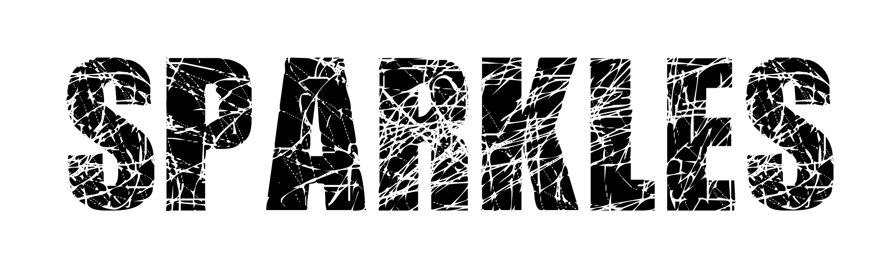
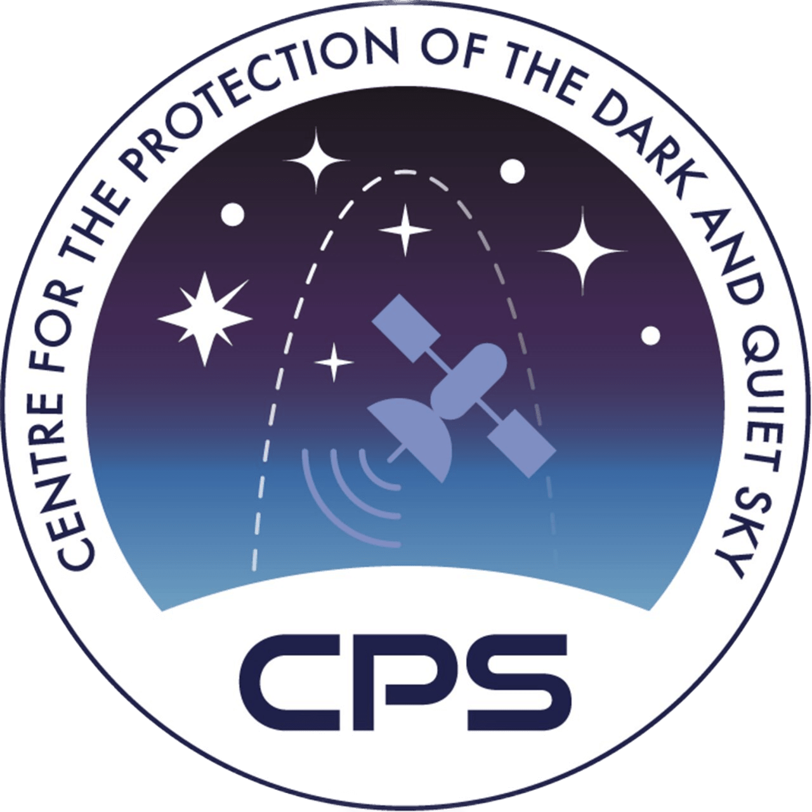
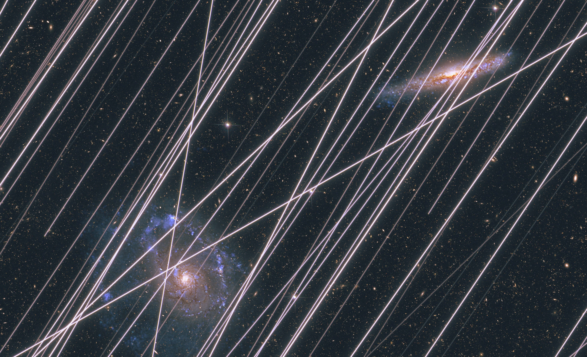
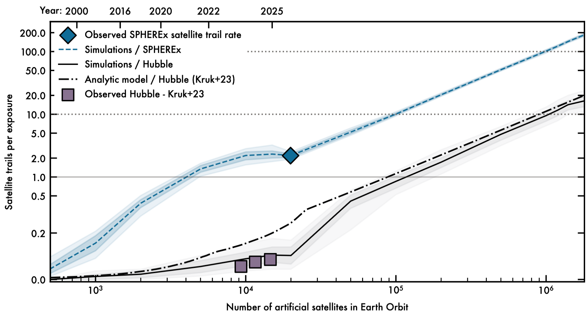

.. SPARKLES documentation master file, created by
   sphinx-quickstart on Mon Apr 20 15:16:03 2026.
   You can adapt this file completely to your liking, but it should at least
   contain the root `toctree` directive.

Project SPARKLES
======================

|pic1| |pic2| |pic3| |pic4|

**SPARKLES** is a NASA Ames Research Center project that provides forecasts and models of satellite trail contamination for space-based astronomy. The documentation presented here serves as a living article following the publication of our research in *Nature* `(Borlaff, Marcum, Howell 2025) <https://www.nature.com/articles/s41586-025-09759-5>`_. As new satellite constellations are announced, launched, and adapted, this repository will gather upgrades to the original paper, improvements in the methodology, and resources for the community to understand and mitigate the impact of satellite megaconstellations on space telescopes.

Overcrowding of Low Earth Orbit (LEO) by artificial satellite constellations is `increasingly threatening the quality of astronomical observations from both ground and space <https://cps.iau.org/resources/public-materials/>`_. Their reflected light and direct emissions can create bright trails in the images captured by telescopes across the whole electromagnetic spectrum when passing through their fields of view. These *satellite trails* outshine the dim emissions from natural sources, such as galaxies, stars, asteroids and even exoplanets. 

The **SPARKLES** project started at NASA Ames Research Center aiming to answer the following question: *How frequent are satellite trails will be in the future for space telescopes?*. In `Borlaff, Marcum, and Howell (2025)
<https://www.nature.com/articles/s41586-025-09759-5>`_ we discovered that if the current plans for satellite constellations are implemented, almost every single image from current and future space telescopes (>92%) will show artificial light contamination from satellites, and the levels and extent of the pollution could greatly increase in the next decades. Artificial satellite trails would have a significant impact on the potential scientific return of some of these missions, as well as on the public's access to the wonders of the Universe. 

In its current stage (July 2026), the *SPARKLES* project aims to provide a long-term repository of accurate forecasts of satellite trail frequencies on various space-based observatories, enabling astronomers, industrial partners, and government agencies to plan more effectively and advocate for responsible satellite constellation management.

.. note::

   Space is hard, and this project is under active development. **The satellite trail levels predicted here are not intended to be by any means a representation of the capabilities of any specific mission, but an approximate representation of the impact of satellite constellations for space based astronomy as a whole**. Satellites may be canceled or proposed, telescopes might adapt, we might find better ways to observe. The future is uncertain, and the models are not perfect.
    
   But satellite trails are increasingly more frequent in the science products from telescopes both on the ground and in space. As conditions change, we keep pushing everyday to make our models better. We will be including software, databases, and tutorials in the very near future. If you are part of a mission and would like to estimate the artificial satellite trail contamination rate, contact us! **SPARKLES** is a NASA Ames Research Center Project that needs your help to improve! If you find a useful capability that could be added, a problem to be resolved, or any other idea, `email us <a.s.borlaff@nasa.gov>`_.

The forecasts are updated based on the latest satellite proposals to the ITU and FCC, as they become available and are implemented in `Jonathan McDowell's Space Report <https://planet4589.org/>`_. The plot below illustrates the latest predictions of the average number of satellite trails per exposure of the selected space telescopes.

Latest Satellite Trail Forecast - April 16th, 2026
===================================================

   
   **Figure 1**: Average number of satellite trails per exposure observed in SPHEREx observations compared against the predicted trail rate from B25, as a function of the population of artificial satellites in Earth orbit (lower x−axis) and epoch (upper x−axis). Blue diamond : Observed average number of satellite trails in SPHEREx images. The different lines represent simulated models for the following observatories. Blue: SPHEREx. Black: Hubble Space Telescope. Contours represent the 95% confidence levels for the mean number of trails. Dashed-dotted line: Predicted number of satellite trails based on S. Kruk et al. (2023). Grey squares: Observer trails in Hubble from 2002–2021 (S. Kruk et al. 2023). Horizontal solid line: One trail per exposure critical contamination level.

Changelog
--------------

- Satellite debris with available cross-sectional area estimations (`*Planet4589* Satellite filtering list <https://planet4589.org/space/supporting/asb/asb.html>`_) are now included in the models. We select the main bus diameter times span of longest appendage as the maximum cross-sectional area of the satellite in face-on orientation (*AREA 2*). Catalogued objects (`Space-track <https://www.space-track.org/>`_) with a) sizes smaller than <1 mm2, b) not orbiting Earth, and c) flagged as *DOWN* (de-orbited), are removed from the simulation. 

- Satellites with known dimensions (i.e., SpaceX Starlink Gen 1, 2, and xAI orbital data centers) have now a fixed area in the simulations. Those satellites for which their dimensions are unknown retain the original size distribution assumed in the original paper (1 -- 125 m2).

- The models include the latest FCC/ITU announcements (March 2026) from CTC1 and CTC2 (96,714 satellites each), and the SpaceX Orbital Data Centers (SXODC, 1,000,000 satellites). The total number of satellites considered (included existing debris, dead, and active satellites, and proposed constellations) adds up to 1,843,084. (`*Planet4589*: Satellite Constellation list <https://planet4589.org/space/con/conlist.html>`_). 

.. toctree::
   :maxdepth: 1
   :caption: Contents:

   forecast
   observations
   methods
   publications
   resources
   whoarewe
   policy

