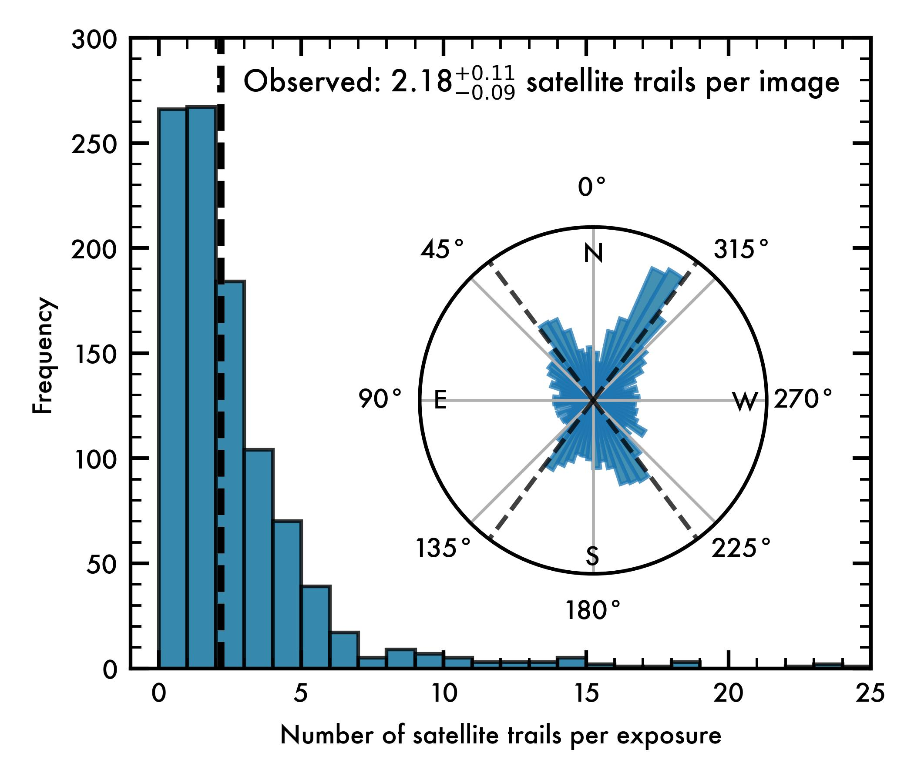
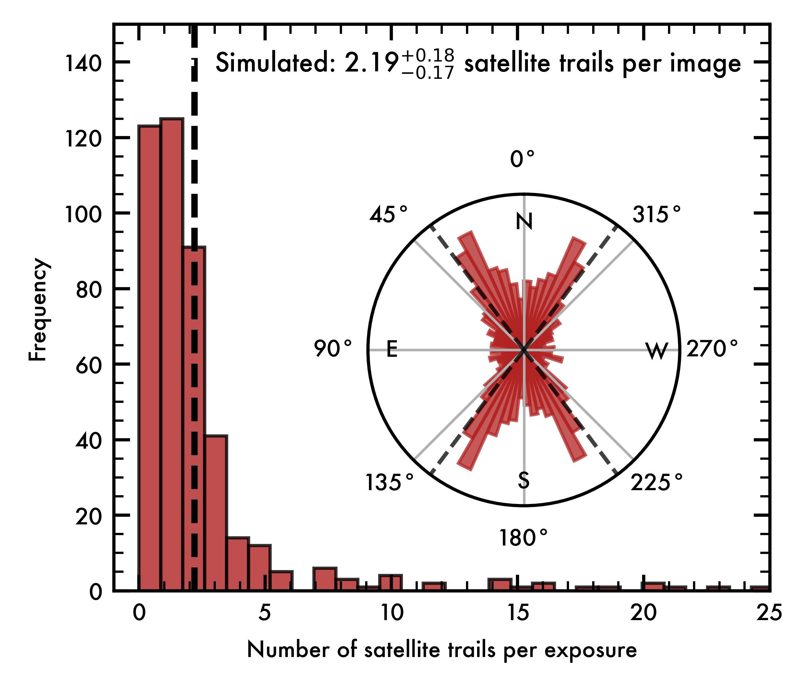

Observations
=====================================

SPHEREx confirms predictions for artificial satellite trail pollution in Low Earth Orbit (Borlaff et al. 2026)
----------------------------------------------------------------------------------------------------------------------------------------------------------------------

In a second paper (Borlaff et al. 2026, accepted for publication by The Astronomical Journal), we present the first observational confirmation of the `Borlaff, Marcum, and Howell (2025)
<https://www.nature.com/articles/s41586-025-09759-5>`_ predictions using data from the SPHEREx space telescope. We find that the observed satellite trail frequencies in SPHEREx data are consistent with our forecasts, confirming that satellite megaconstellations are already impacting space-based astronomy and will continue to do so in the future.

All the data and models used in this paper are available in the `associated Zenodo repository <https://doi.org/10.5281/zenodo.17957748>`_, including the identification of satellite trails in SPHEREx images, their exposure IDs, projected sky positions and orientations. `The accepted version of the manuscript is publicly available here <https://raw.githubusercontent.com/Borlaff/SPARKLES/main/PUBLICATIONS/SPHEREx_borlaff_AJ_2026.pdf>`_.

.. figure:: ../../images/PAPER_2/2025W18_1B_0393_annotated_lite.jpeg
   :width: 100%
   :alt: 

   **Figure 1**: Example of satellite trail identification on one of the SPHEREx exposures. Exposure ID: 2025W18_1B_0393_3 (Obs. date: 2025-07-17 T22:12:03.217). From bottom to top, left to right: Band 1: (:math:`\lambda=0.75−1.09\,\mu\rm{m}`); Band 2: (:math:`\lambda=1.10−1.62\,\mu\rm{m}`); Band 3: (:math:`\lambda=1.63 − 2.41\,\mu\rm{m}`); Band 4: (:math:`\lambda=2.42 − 3.82\,\mu\rm{m}`); Band 5: (:math:`\lambda=3.83 − 4.41\,\mu\rm{m}`); Band 6: (:math:`\lambda=4.42 − 5.00\,\mu\rm{m}`).

Our finding show that SPHEREx observations obtained between May and September 2025 indicate that :math:`73.3^{+1.3}_{−1.2}%` of the images already show satellite trail contamination, with an average number of :math:`N = 2.18^{+0.11}_{−0.09}` trails per exposure. These observationals results are compatible with the predictions from our simulation-based models, that predict a rate of :math:`N = 2.19^{+0.18}_{−0.17}` artificial satellite trails per SPHEREx exposure in 2025. In addition to the satellite trail frequency, we find that the observed satellite trails display highly inclined trajectories - which is expected from the average inclination from telecommunication satellites - in agreement with the simulated ones. These two quantitative factors provide a strong observational validation of the published light contamination models in `(Borlaff, Marcum, Howell 2025) <https://www.nature.com/articles/s41586-025-09759-5>`_.

|pic1| |pic2| 

**Figure 2**: Distribution of artificial satellite trails in SPHEREx science images. Left (blue) and right (red) panels represents the observations and simulated SPHEREx results. Main panel: Histogram of number of trails per exposure. The average number of trails is :math:`N = 2.18^{+0.11}_{−0.09}` in the observations, and :math:`N = 2.19^{+0.18}_{−0.17}` trails per image in the simulations. Polar subpanel: Histogram of satellite trail directions on equatorial (RA, Dec) coordinates. The diagonal dashed lines represent the average satellite orbit inclination (53.16◦).

.. note::
    This article has been recently accepted for publication by The Astronomical Journal, but as always, comments and suggestions are welcome! If you have any question or correction about the paper, the data, or the models, please `email us <mailto:a.s.borlaff@nasa.gov>`_.

.. figure:: ../../images/PAPER_2/examples_spherex_trails.png
   :width: 100%
   :alt: 

   **Figure 3**:  Examples of the different morphologies of artificial satellite trails in SPHEREx science images. Brighter events tend to display broader trails with low signal residuals in their cores due to the effect of sample up-the-ramp (SUR) algorithm. Labels on each panel display the observation ID.